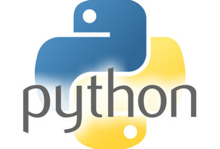

# Data Representation and Querying Project 2016
## This Repository Contains all the relevant code and information to run our web application.

## Contents

[Team Members](#team-members)  
[Project Overview](#overview)  
[Meetings](#meetings)  
[Running the Application](#run-app)  
[Architecture](#architecture)  
[References](#References)  

## Team Members<a name = "team-members"></a>  
- Patrick Moran <g00179039@gmit.ie>  
- Gerard Naughton <g00209309@gmit.ie>

## Project Overview<a name = "overview"></a>  

One of our third year software projects is to develop a single-page web application (SPA) written in python. The module is called Data Representation and Querying and is taught to us in [GMIT](http://www.gmit.ie) Galway, Ireland.  

 

The following are the main instructions from the project specifications.  
>You are required to develop a single-page web application (SPA) written
in the programming language Python using the Flask framework.
You must devise an idea for a web application, write the software, write
documentation explaining how the application works, and write a short user
guide for it.  

Both Gerard and myself have a keen interest in football and the English Premier League. We therefore decided early on to try and make a single web application based on this fact.

After deciding on a fantasy football theme we took a look at some other web applications that already do something similar.

* Below are some of these examples  
http://www.fantasyfootballscout.co.uk/  

Given the timeframe for the project was only a few months our web application was naturally going to be smaller than some of the examples above.

#####  Here are the essentials we decided our web app must have.  
* Easy to use interface for the client. We want the user to have an easy flow through experience using our application.
* A forum where users can post comments relating to the subject and communicate with each other.  
* On our end, to make it an application, this data from the user must be manipulated. We decided to store the data in a database and have that data rendered on the web page.
* The ability to add a new fantasy football team on a weekly basis. Hard coding it at first but hopefully coming up with a better way.   

##### Advanced Features
* Admin Login and Team Updates

In the beginning we were unsure if these features would be added but we successfully managed to get them up and running in time.  
These features allow the admin, in this case Gerard and myself, to login and change our team selection, any time we want, from the website using the database to store our data. Instructions to do this and more will in the [Running the Application](#run-app) section.

## Meetings<a name = "team-members"></a>

## Running The Application<a name = "run-app"></a>

## Architecture<a name = "architecture"></a>
###### In our project we have used:   
* **Languages Used**   
    
Python  
https://www.python.org/   
  
HTML5   
https://www.w3.org/html/  

   
CSS3    
https://www.w3.org/Style/CSS/Overview.en.html  

* **Frameworks**  
Flask  
http://flask.pocoo.org/
* **Libraries**  
    
Bootstrap  
http://getbootstrap.com/  

* **Databases**   
     
Sqlite3  
https://sqlite.org/  

###### Jinja 2  
Jinja2 is a modern and designer-friendly templating language for Python, modelled after Django’s templates. It is fast, widely used and secure with the optional sandboxed template execution environment. It comes installed and ready to use with the flask framework.  
    
http://jinja.pocoo.org/docs/dev/  
In order to have a clean, easier to read codebase we decided to make use of [Jinja Template Inheritence](http://flask.pocoo.org/docs/0.11/patterns/templateinheritance/). Its a  powerful feature of Jinja which allows the developer to build a base “skeleton” template that contains all the common elements of your site and defines blocks that child templates can override.  
We have one html base class which contains all the static code for our web application, for example the navbar and the footer are written just once in here. All other child templates extend from this base class.  
Below is an exert of what the base class would look like.

```
<!DOCTYPE html>
.
.
.

--- Navbar code here ---



child template goes here



 <!-- errors -->

    <p class="error"><strong>Error:</strong> {{ error }}</p>


<!-- messages -->

    {{ message }}

.
.
Footer Goes Here
```
And a child Template might look like
```
<!-- Child Template -->



All code relevant to this html file goes in here


```


## References<a name = "References"></a>
* Online Video Tutorials  
https://www.youtube.com/playlist?list=PLLjmbh6XPGK4ISY747FUHXEl9lBxre4mM  
https://www.youtube.com/watch?v=Lv1fv-HmkQo&list=PLQVvvaa0QuDc_owjTbIY4rbgXOFkUYOUB  

* Login with message flashing - Advanced Feature  
http://flask.pocoo.org/docs/0.11/patterns/flashing/  

* Other References  
http://stackoverflow.com/questions/19759349/how-to-insert-variable-into-sqlite-database-in-python
http://getbootstrap.com/  
http://flask.pocoo.org/docs/0.11/    

* Images  
http://jaydata.org/Media/Default/Provider/LeadImage/sqlite-1.png  
http://gel.ed.ac.uk/sites/default/files/styles/landscape_breakpoints_theme_uoe_mobile_1x/public/thumbnails/image/bootstrap250x250.png?itok=pRJ7rNAz
http://webroad.pl/wp-content/uploads/2014/07/css3-logo-250x250.jpg  
http://tupleware.cs.brown.edu/wordpress/wp-content/uploads/2014/03/python.png  
https://davidwalsh.name/demo/html5250.png?preview
http://jinja.pocoo.org/docs/dev/_static/jinja-small.png
