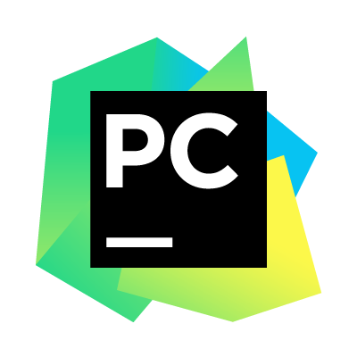

# Data Representation and Querying Project 2016
## This Repository Contains all the relevant code and information to run our web application.

## Contents

[Team Members](#team-members)  
[Project Overview](#overview)  
[Meetings](#meetings)  
[Integrated Development Environment](#ide)  
[Running the Application](#run-app)  
[Architecture](#architecture)  
[References](#References)  

## Team Members<a name = "team-members"></a>  
- Patrick Moran <g00179039@gmit.ie>  
- Gerard Naughton <g00209309@gmit.ie>

We both contributed to all aspects of the project. We both knew because we are both working as well as in college we would have to have knowledge on both back end and front end of the application so while one of us was working we would not be held back from continuing further in the project. We had several meetings and when possible coded alongside each other in order to learn and progress.
We both found that we worked well as a team and would not be afraid to work together again.


## Project Overview<a name = "overview"></a>  

One of our third year software projects is to develop a single-page web application (SPA) written in python. The module is called Data Representation and Querying and is taught to us in [GMIT](http://www.gmit.ie) Galway, Ireland.  

 


The following are the main instructions from the project specifications.  
>You are required to develop a single-page web application (SPA) written
in the programming language Python using the Flask framework.
You must devise an idea for a web application, write the software, write
documentation explaining how the application works, and write a short user
guide for it.  

Both Gerard and myself have a keen interest in football and the English Premier League. We therefore decided early on to try and make a single web application based on this fact.

After deciding on a fantasy football theme we took a look at some other web applications that already do something similar.

* Below are some of these examples  
http://www.fantasyfootballscout.co.uk/  
http://www.fiso.co.uk/forum/viewforum.php?f=18   

Given the timeframe for the project was only a few months our web application was naturally going to be smaller than some of the examples above.

#####  Here are the essentials we decided our web app must have.  
* Easy to use interface for the client. We want the user to have an easy flow through experience using our application.
* A forum where users can post comments relating to the subject and communicate with each other.  
* On our end, to make it an application, this data from the user must be manipulated. We decided to store the data in a database and have that data rendered on the web page.
* The ability to add a new fantasy football team on a weekly basis. Hard coding it at first but hopefully coming up with a better way.   

##### Advanced Features
* Admin Login and Team Updates

In the beginning we were unsure if these features would be added but we successfully managed to get them up and running in time.  
These features allow the admin, in this case Gerard and myself, to login and change our team selection, any time we want, from the website using the database to store our data. Instructions to do this and more will in the [Running the Application](#run-app) section.

## Here is a link to our youtube video describing our Web Application

[](https://www.youtube.com/watch?v=i2dTv00f4Xw&feature=youtu.be&hd=1)
## Meetings<a name = "meetings"></a>
Team meetings were held in either the Canteen or Library study rooms when they were available in the Galway Mayo Institute of Technology(GMIT), Dublin Road, County Galway.
During the course of the Project we had 6 meetings in total.

* Thursday 10th November 2016 13.00

We met in Study Room 5A and discussed on what we should do our Single page web-app on. Making sure it met the course projects requirements and was useful to the user.

* Thursday 17th November 10.00

We met in the Canteen and wrote out the html templates needed and what they should look like for our app. We also discussed the software requirements we would need to run the application and set out that we would have them installed and ready for the next meeting.

* Tuesday 22nd November 13.00

We met in Study Room 5B and we set up our git repository and published our first commit with the structure of our app. We then decided on what steps to work on next. Patrick would start on the routing system and form pages. Gerard would begin setting up the structure of our html pages and connecting up our pages to bootstrap.

* Thursday 24th November 10.00

We met up in Study Room 5A and began setting up our database. We initially decided to use couch.db. We hit a few problems with couch.db and found little documentation online to help. Patrick was going to continue on researching and if could not be solved we would look into using Sqlite3.

* Friday 25th November 10.00

We had a emergency meeting Friday over the phone about our database. We both decided to switch to Sqlite3 as there was more documentation online and we have experience of SQL from Second Year Computer Software and development. Patrick would work on importing Sqlite3 into the project and creating our sql.py. Gerard would work on taking in data from the form and putting it out to our database. We would meet up in Patricks house later to both work on html pages and css.

* Monday 28th November 12.00

We met up in Study Room 6A. After getting the main functionality of the app working we decided we had time to do the Advanced Features. Patrick worked on setting up login page and routing. Gerard worked on TeamEntry page, input of data to database and outputting it to the Home page. We then worked on tidying up the css and code. Patrick had previously made a template for the README.md file. We separated out what parts of the README.md we would carry out. Gerard would take on Team Members, Meetings and Running the Application. Patrick would work on Project Overview and Architecture. We would both work on References. This would be our last meeting.  

## Integrated Development Environment<a name = "ide"></a>
  


The integrated development environment (IDE) we are using to manage our web application is [PyCharm](https://www.jetbrains.com/pycharm/specials/pycharm/pycharm.html?&gclid=CjwKEAiAjvrBBRDxm_nRusW3q1QSJAAzRI1tMeRbsl3nnPUUTJ5L67BdVe3Y8VA9VU3MoAYDhNFNLBoCmKfw_wcB&gclsrc=aw.ds.ds&dclid=CMTU-e7C0dACFY2D7QodmzYJxw). PyCharm was developed by [JetBrains](https://www.jetbrains.com/) and is the perfect environment for working with python.

Being students allowed us to get the professional edition of the IDE free of charge for as long as we are studying. If you are interested click [here](https://www.jetbrains.com/student/).

## Running The Application<a name = "run-app"></a>

The application is written using the Flask library in Python 3.5.2. Both must be installed to run the project.

We use the sqlite3 package for persistence in the application. This must also be installed. However no further configuration of our setup is required, as the database is fully contained in the data directory in this repository.

###### Links for installation of software and how to install them.

* Python 3.5.2

You will be able to download this version of Python on the www.python.org website.
You can also click the link provided below to navigate to this page:
(https://www.python.org/downloads/)

After clicking on the Download Python 3.5.2, navigate down the page and select which download is applicable to your laptop or desktop computer.

After the file has downloaded click to begin installation. Follow the step by step guide and then click finish. We recommend the default options. To check that it has installed properly go to your Command Prompt and type in the command:

```
> python
```
This should return the version of python installed.

* Flask

To install Flask seems more complicated but is actually pretty easy.

Lets start with pip. If you have pip installed on your device already you can skip this step. Pip is a Package management system written in python.

- For windows:
Since we have previously installed python this is a lot easier. To install open a command prompt window and navigate to the folder containing get-pip.py . Then run:
```
> python get-pip.py
```
 This will install pip . Verify a successful installation by opening a command prompt window and navigating to your Python installation's script directory.

- For Mac:
On Mac it is far simpler just open your command prompt and use the command:
```
> sudo easy_install pip
```
Now to install flask. Now that we have pip installed it is very simple.
Simply in your command prompt for Windows use the command:
```
> pip install flask
```
And for mac type the command:
```
> sudo pip install flask
```

* Sqlite3

Some new packages of python already contain sqlite libraries and do not require you to download sqlite3 but just incase you dont have them this is how you download sqlite3:

To download sqlite visit the Sqlite downloads page which is linked below:
(https://www.sqlite.org/download.html)

Scrolling down the menu you will find windows and mac options. Within in those option you should see a sqlite3 tools package. Click to download.

After downloading extract the files from the zip folder and if you look inside the folder you will find Sqlite3.exe. Copy this and navigate to your route and create a new folder in program files called sqlite. Open the folder and inside paste in the exe file you just copied. To make sure that sqlite3 is properly installed open your command prompt and navigate to the new sqlite folder you just created. Then type the command "sqlite3" this should return the version of sqlite installed.

###### Running the Application.

First open your command prompt. Then navigate to the folder where the application is saved. If the prerequisites have been installed correctly the application can be run locally:

- First you will have to set up the Sql database. Simply type the following command:
```
> python sql.py"
```

- Second you will run the application. Simply type the following command:
```
> python app.py
```

Once the application is running, it can be accessed by pointing your browser at http://127.0.0.1:5000/.


## Architecture<a name = "architecture"></a>
#### In our project we have used:    

* **Languages**

Python | HTML | CSS
------ |  --- | ---
  |   |      
https://www.python.org/ | https://www.w3.org/html/  | https://www.w3.org/Style/CSS/Overview.en.html   

 * **Frameworks**  
  Flask  
 http://flask.pocoo.org/  

* **Libraries**  

| Bootstrap | JQuery
| --------- | ------   
|  |  

| http://getbootstrap.com/ |  https://jquery.com/

* **Databases**  

| Sqlite  
| ------    
|    
|  https://sqlite.org/     

###### Jinja 2  
Jinja2 is a modern and designer-friendly templating language for Python, modelled after Django’s templates. It is fast, widely used and secure with the optional sandboxed template execution environment. It comes installed and ready to use with the flask framework.  
    
http://jinja.pocoo.org/docs/dev/  
In order to have a clean, easier to read codebase we decided to make use of [Jinja Template Inheritence](http://flask.pocoo.org/docs/0.11/patterns/templateinheritance/). Its a  powerful feature of Jinja which allows the developer to build a base “skeleton” template that contains all the common elements of your site and defines blocks that child templates can override.  
We have one html base class which contains all the static code for our web application, for example the navbar and the footer are written just once in here. All other child templates extend from this base class.  
Below is an exert of what the base class would look like.

```
<!DOCTYPE html>
.
.
.

--- Navbar code here ---



child template goes here



 <!-- errors -->

    <p class="error"><strong>Error:</strong> {{ error }}</p>


<!-- messages -->

    {{ message }}

.
.
Footer Goes Here
```
And a child Template might look like
```
<!-- Child Template -->



All code relevant to this html file goes in here


```


## References<a name = "References"></a>
* Online Video Tutorials  
https://www.youtube.com/playlist?list=PLLjmbh6XPGK4ISY747FUHXEl9lBxre4mM  
https://www.youtube.com/watch?v=Lv1fv-HmkQo&list=PLQVvvaa0QuDc_owjTbIY4rbgXOFkUYOUB  

* Login with message flashing - Advanced Feature  
http://flask.pocoo.org/docs/0.11/patterns/flashing/  

* Other References  
http://stackoverflow.com/questions/19759349/how-to-insert-variable-into-sqlite-database-in-python
http://getbootstrap.com/  
http://flask.pocoo.org/docs/0.11/  
http://graphicdesign.stackexchange.com/questions/29256/text-not-very-readable-on-different-image-backgrounds  

* Images  
http://jaydata.org/Media/Default/Provider/LeadImage/sqlite-1.png  
http://gel.ed.ac.uk/sites/default/files/styles/landscape_breakpoints_theme_uoe_mobile_1x/public/thumbnails/image/bootstrap250x250.png?itok=pRJ7rNAz
http://webroad.pl/wp-content/uploads/2014/07/css3-logo-250x250.jpg  
http://tupleware.cs.brown.edu/wordpress/wp-content/uploads/2014/03/python.png  
https://davidwalsh.name/demo/html5250.png?preview
http://jinja.pocoo.org/docs/dev/_static/jinja-small.png  
http://d3gnp09177mxuh.cloudfront.net/tech-page-images/jquery.png  
https://d3nmt5vlzunoa1.cloudfront.net/pycharm/files/2015/12/PyCharm_400x400_Twitter_logo_white.png
http://alex-masters.squarespace.com/
